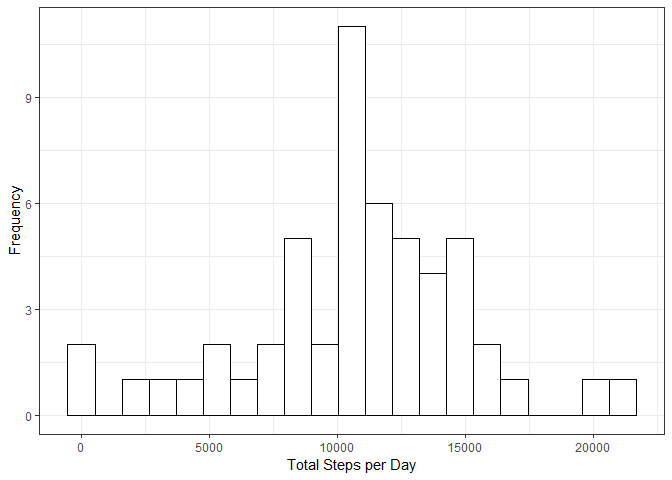
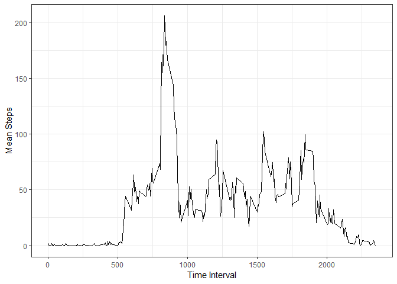
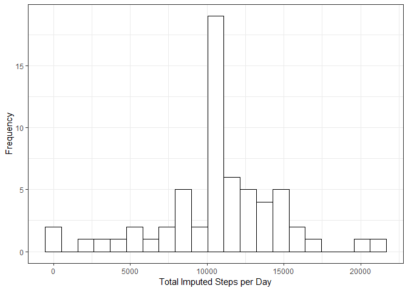
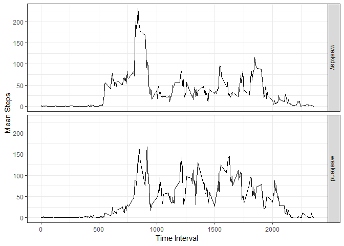

## Loading and preprocessing the data

```r
library(dplyr)
```

```
## 
## Attaching package: 'dplyr'
```

```
## The following objects are masked from 'package:stats':
## 
##     filter, lag
```

```
## The following objects are masked from 'package:base':
## 
##     intersect, setdiff, setequal, union
```

```r
library(lubridate)
```

```
## 
## Attaching package: 'lubridate'
```

```
## The following object is masked from 'package:base':
## 
##     date
```

```r
library(ggplot2)
```

```
## Warning: package 'ggplot2' was built under R version 3.5.2
```

```r
data <- read.csv(unzip("activity.zip"))
data$date <- ymd(data$date)
grouped_by_date <- data %>% group_by(date) %>% summarise(total_steps = sum(steps))
p <- ggplot(data = grouped_by_date, aes(x = total_steps)) +
    geom_histogram(bins = 21, color="black", fill="white") +
    xlab("Total Steps per Day") + 
    ylab("Frequency") +
    theme_bw()
print(p)
```

```
## Warning: Removed 8 rows containing non-finite values (stat_bin).
```

<!-- -->

## What is mean total number of steps taken per day?

```r
mean_steps_per_day <- mean(grouped_by_date$total_steps, na.rm = TRUE)
median_steps_per_day <- median(grouped_by_date$total_steps, na.rm = TRUE)
paste("Mean steps per day =", mean_steps_per_day)
```

```
## [1] "Mean steps per day = 10766.1886792453"
```

```r
paste("Median steps per day =", median_steps_per_day)
```

```
## [1] "Median steps per day = 10765"
```

## What is the average daily activity pattern?

```r
grouped_by_interval <- data %>% group_by(interval) %>% summarise(mean_steps = mean(steps, na.rm = TRUE), median_steps = median(steps, na.rm = TRUE))
p <- ggplot(data = grouped_by_interval, aes(x = interval, y = mean_steps)) +
    geom_line(aes(group=1)) +
    xlab("Time Interval") + 
    ylab("Mean Steps") +
    theme_bw()
print(p)
```

<!-- -->

```r
highest_interval <- grouped_by_interval$interval[which.max(grouped_by_interval$mean_steps)]
paste("Interval with the highest mean steps =", highest_interval)
```

```
## [1] "Interval with the highest mean steps = 835"
```

## Imputing missing values

```r
missing_values <- data %>% filter(is.na(steps)) %>% tally()
paste("Data has", missing_values, "missing values")
```

```
## [1] "Data has 2304 missing values"
```

```r
imputed_data <- data %>%
    inner_join(grouped_by_interval, by = "interval") %>%
    mutate(imputed_steps = ifelse(is.na(steps), mean_steps, steps))
imputed_grouped_by_date <- imputed_data %>% group_by(date) %>% summarise(total_steps = sum(imputed_steps))
p <- ggplot(data = imputed_grouped_by_date, aes(x = total_steps)) +
    geom_histogram(bins = 21, color="black", fill="white") +
    xlab("Total Imputed Steps per Day") + 
    ylab("Frequency") +
    theme_bw()

print(p)
```

<!-- -->

```r
mean_imputed_steps_per_day <- mean(imputed_grouped_by_date$total_steps)
median_imputed_steps_per_day <- median(imputed_grouped_by_date$total_steps)
paste("Mean imputed steps per day =", mean_imputed_steps_per_day)
```

```
## [1] "Mean imputed steps per day = 10766.1886792453"
```

```r
paste("Median imputed steps per day =", median_imputed_steps_per_day)
```

```
## [1] "Median imputed steps per day = 10766.1886792453"
```
Filling in missin values with average values made very little difference to the mean and median.

## Are there differences in activity patterns between weekdays and weekends?

```r
imputed_data <- imputed_data %>%
    mutate(day_type = as.factor(ifelse(weekdays(date) %in% c("Saturday", "Sunday"), "weekend", "weekday")))
imputed_grouped_by_interval <- imputed_data %>% group_by(interval, day_type) %>% summarise(mean_steps = mean(imputed_steps))
p <- ggplot(data = imputed_grouped_by_interval, aes(x = interval, y = mean_steps)) +
    geom_line(aes(group=1)) +
    facet_grid(day_type ~ .) +
    xlab("Time Interval") + 
    ylab("Mean Steps") +
    theme_bw()
print(p)
```

<!-- -->
